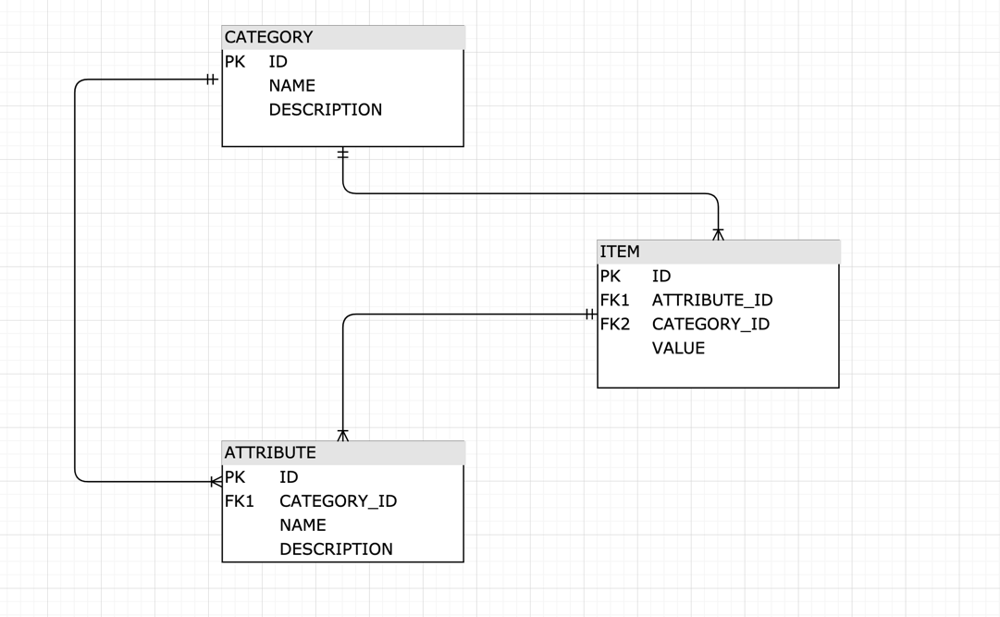

<p align="center">

<h3 align="center">HOME TASK</h3>


<!-- TABLE OF CONTENTS -->
<details open="open">
  <summary>Table of Contents</summary>
  <ol>
    <li><a href="#introduction">Introduction</a></li>
    <li><a href="#used-tech">Used Tech</a></li>
    <li><a href="#model">Model</a></li>
    <li><a href="#conclusion">Conclusion</a></li>
  </ol>
</details>


<!-- INTRODUCTION -->
## Introduction
Requirement is a solution for scientists to store their experiment data items; including samples, chemicals, devices, etc...!
I've tried to keep logic and models as simple as I can.
</br>


## Used Tech

1. Java 11
2. Mysql
3. Spring Boot 2.5.2
4. Lombok
5. Mapstruct
6. Swagger (http://localhost:8080/swagger-ui/)


<!-- Model -->
## Model
I've used RDBMS db model. As can be seen below from the image, db consists 3 tables; category, attribute and item.
Category table has one-to-many relation with attribute and item table both.
Attribute table has one-to-many relation with item table.
```sh
   category --> attribute
     |              |_______>
     |                        item
     |______________________>
   ```
Considering users can dynamically define categories with attributes, an attribute can have multiple categories
and also an item can have multiple attributes and categories too.
</br></br>

Db Model

</br></br>


<!-- Conclusion -->
## conclusion
This project offers scientists to store their various items that used in their experiments with API end-points create, update and get types.